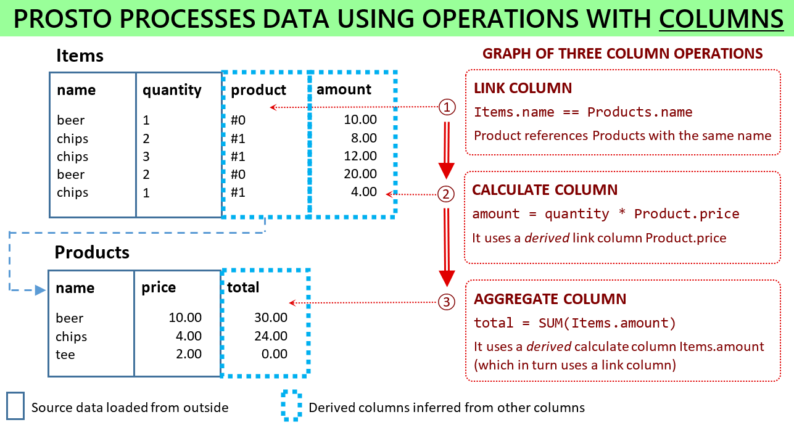

```
 ____                _        
|  _ \ _ __ ___  ___| |_ ___   _________________________________________________
| |_) | '__/ _ \/ __| __/ _ \ 
|  __/| | | (_) \__ \ || (_) | Functions matter! No map-reduce. No join-groupby.
|_|   |_|  \___/|___/\__\___/  _________________________________________________
```
[](https://github.com/asavinov/prosto/blob/master/LICENSE)
[](https://pypi.python.org/pypi/prosto)
[](https://github.com/asavinov/prosto)
[](https://www.python.org/downloads/release/python-370/)
[](https://prosto.readthedocs.io/en/latest/?badge=latest)
[](https://github.com/asavinov/prosto/actions)

[](https://www.researchgate.net/publication/348079767_On_the_importance_of_functions_in_data_modeling)
[](https://www.researchgate.net/publication/337336089_Concept-oriented_model_Modeling_and_processing_data_using_functions)
[](https://www.researchgate.net/publication/316551218_From_Group-by_to_Accumulation_Data_Aggregation_Revisited)
[](https://www.researchgate.net/publication/303840097_Concept-Oriented_Model_the_Functional_View)
[](https://www.researchgate.net/publication/301764816_Joins_vs_Links_or_Relational_Join_Considered_Harmful)
• [**DOCUMENTATION**](http://prosto.readthedocs.io/)

• [**Why Prosto?**](#why-prosto) • [**Quick start**](#quick-start) • [**How to use**](#how-to-use) • [**References**](#references) •

`Prosto` is a Python data processing toolkit to author and execute complex data processing workflows. Conceptually, it is an alternative to purely *set-oriented* approaches to data processing like map-reduce, relational algebra, SQL or data-frame-based tools like `pandas`.

`Prosto` radically changes the way data is processed by relying on a novel data processing paradigm: *concept-oriented model* of data [[2]](#1). It treats columns (modelled via mathematical functions) as first-class elements of the data processing pipeline having the same rights as tables. If a traditional data processing graph consists of only set operations than the `Prosto` workflow consists of two types of operations:

* *Table operations* produce (populate) new tables from existing tables. A table is an implementation of a mathematical *set* which is a collection of tuples.

* *Column operations* produce (evaluate) new columns from existing columns. A column is an implementation of a mathematical *function* which maps tuples from one set to another set.

An example of such a `Prosto` workflow consisting of 3 column operations is shown below. The main difference from traditional approaches is that this `Prosto` workflow will not modify any table - it changes only columns. Formally, if traditional approaches apply set operations by generating new sets from already inferred sets, then `Prosto` derives new *functions* from existing functions. In many cases, using functions (column operations) is much simpler and more natural.



`Prosto` provides two ways to define its operations:
* Programmatically by calling function with parameters specifying an operation
* Column-SQL by means of syntactic statements with all operation parameters

`Prosto` operations are demonstrated in notebooks which can be found in the "notebooks" folder in the main repo. Do your own experiments by tweaking them and playing around with the code: https://github.com/asavinov/prosto/tree/master/notebooks

More detailed information can be found in the documentation: http://prosto.readthedocs.io 

# Motivation: Why Prosto?

## Why functions and column-orientation?

In traditional approaches to data processing we frequently need to produce a new table even though we need to define a new attribute. For example, in SQL, a new relation has to be produced even if we want to define a new calculated attribute. We also need to produce a new relation (using join) if we want to process data from another table. Data aggregation by means of groupy operation produces a new relation too although the goal is to compute a new attribute.

Thus processing data using *only* set operations is in many quite important cases counter-intuitive. In particular, this is why map-reduce, join-groupby (including SQL) and similar approaches require high expertise and are error-prone. The main unique novel feature of `Prosto` is that it adds mathematical *functions* (implemented as columns) to its model by significantly simplifying data processing and analysis. Now, if we want to define a new attribute then we can do it directly without defining new unnecessary table, collection or relation.

More info: [Why functions and column-orientation?](https://prosto.readthedocs.io/en/latest/text/why.html#why-functions-and-column-orientation)

## Benefits of Prosto 

`Prosto` provides the following unique features and benefits:

* Easily processing data in multiple tables. New derived columns are added directly to tables  without creating multiple intermediate tables

* Getting rid of join and group-by. Column definitions such as link columns and aggregate columns are used instead of join and groupby set operations

* Flexibility and modularization via user-defined functions. UDFs describe what needs to be done with the data only in this operation using arbitrary Python code. If UDF for an operation changes then it is not necessary to update other operations

* Parameterization of operations by a model object. A model can be as simple as one value and as complex as a trained deep neural network. This feature leads to a novel view of how data analysis should be organized by combining feature engineering and machine learning so that both model training and model use (predictions or transformations) are part of one data processing workflow. Currently models are supported only as static parameters but in future there will be a possibility to train model within the same workflow

* Future directions. Incremental evaluation and data dictionary

More info: [Benefits of Prosto](https://prosto.readthedocs.io/en/latest/text/why.html#benefits-of-prosto)

# Quick start

## Creating a workflow

All data elements (tables and columns) as well as operations for data generation are defined in a workflow object (interpreted as a context):

```python
import prosto as pr
prosto = pr.Prosto("My Prosto Workflow")
```

More info: [Workflow and operations](https://prosto.readthedocs.io/en/latest/text/workflow.html)

## Populating a source table

Each table has some structure which is defined by its *attributes*. Table data is defined by the tuples it consists of and each tuple is a combination of some attribute values.

The simplest way to populate a source table is to create or load a `pandas` data frame and then pass it to a Column-SQL statement: 

```python
sales_data = {
    "product_name": ["beer", "chips", "chips", "beer", "chips"],
    "quantity": [1, 2, 3, 2, 1],
    "price": [10.0, 5.0, 6.0, 15.0, 4.0]
}
sales_df = pd.DataFrame(sales_data)

prosto.column_sql("TABLE Sales", sales_df)
```
The Column-SQL statement `TABLE Sales` will create a definition of a source table with data from the `sales_df` data frame.

In more complex cases, we could pass a *user-defined function* (UDF) instead of the data frame. This function is supposed to "know" where to load data from by returning a `pandas` data. For example, it could load data from a `csv` file.

More info: [Table operations](https://prosto.readthedocs.io/en/latest/text/tables.html)

## Defining a calculate column

A column is formally interpreted as a mathematical function which maps tuples (defined by table attributes) of this table to output values. The simplest column operation is a `calculate` column which *computes* output values using the values of the specified input columns of the same table:

```python
prosto.column_sql(
    "CALCULATE  Sales(quantity, price) -> amount",
    lambda x: x["quantity"] * x["price"]
)
```

This new `amount` column will store the amount computed for each record as a product of `quantity` and `price`. The `CALCULATE` statement consists of two parts separated by arrow: 
* First, we define the source table and its columns that we want to process as input: `Sales(quantity, price)`
* Second, we define a column to be created: `amount` 

This use of arrows is an important syntactic convention of Column-SQL which informally represent a flow of data within one table or between tables.

More info: [Column operations](https://prosto.readthedocs.io/en/latest/text/columns.html)

## Executing a workflow

A workflow object stores only operation *definitions*. In order to really process data, the workflow has to be executed:

```python
prosto.run()
```

`Prosto` translates a workflow into a graph of operations (topology) taking into account their dependencies and then executes each operation.

Now we can explore the result by reading data form the table along with the calculate column:

```python
df = prosto.get_table("Sales").get_df()
print(df)
```

```
   product_name quantity price amount
0  beer         1        10.0  10.0
1  chips        2        5.0   10.0
2  chips        3        6.0   18.0
3  beer         2        15.0  30.0
4  chips        1        4.0   4.0
```

The `amount` column was derived from the data in other columns. If we change input data, then we can again run this workflow and the derived column will contain updated results.

The full power of `Prosto` comes from the ability to process data in multiple tables by definining derived links (instead of joins) and then aggregating data based on these links (without groupby). Note that both linking and aggregation do not require and will not produce new tables: only columns are defined and evaluated. For example, we might use column paths like `my_derived_link::my_column` in operations in order to access data in other tables.

More info: [Column-SQL](https://prosto.readthedocs.io/en/latest/text/column-sql.html)

# How to use

## Install from source code

Check out the source code and execute this command in the project directory (where `setup.py` is located):

```console
$ pip install .
```

Or alternatively:

```console
$ python setup.py install
```

## Install from PYPI

This command will install the latest release of `Prosto` from PYPI:

```console
$ pip install prosto
```

## How to test

Run tests from the project root:

```console
$ python -m pytest
```

or

```console
$ python setup.py test
```

# References

<a id="1"></a>[1]: A.Savinov. On the importance of functions in data modeling, Eprint: [arXiv:2012.15570](https://arxiv.org/abs/2012.15570) [cs.DB], 2019. <https://www.researchgate.net/publication/348079767_On_the_importance_of_functions_in_data_modeling>

<a id="2"></a>[2]: A.Savinov. Concept-oriented model: Modeling and processing data using functions, Eprint: [arXiv:1606.02237](https://arxiv.org/abs/1911.07225) [cs.DB], 2019. <https://www.researchgate.net/publication/337336089_Concept-oriented_model_Modeling_and_processing_data_using_functions>

<a id="3"></a>[3]: A.Savinov. From Group-By to Accumulation: Data Aggregation Revisited, Proc. IoTBDS 2017, 370-379. <https://www.researchgate.net/publication/316551218_From_Group-by_to_Accumulation_Data_Aggregation_Revisited>

<a id="4"></a>[4]: A.Savinov. Concept-oriented model: the Functional View, Eprint: [arXiv:1606.02237](https://arxiv.org/abs/1606.02237) [cs.DB], 2016. <https://www.researchgate.net/publication/303840097_Concept-Oriented_Model_the_Functional_View>

<a id="5"></a>[5]: A.Savinov. Joins vs. Links or Relational Join Considered Harmful, Proc. IoTBD 2016, 362-368. <https://www.researchgate.net/publication/301764816_Joins_vs_Links_or_Relational_Join_Considered_Harmful>
