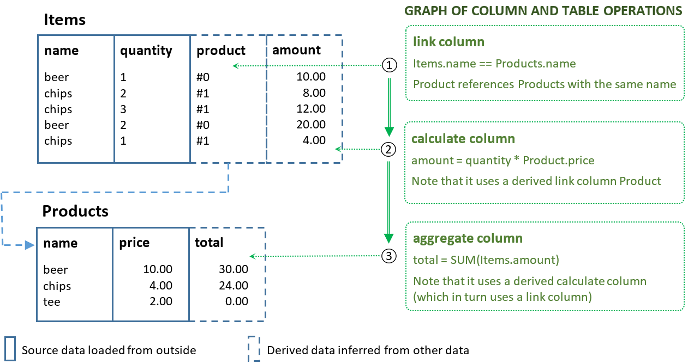

Welcome to Prosto documentation!
================================

`Prosto` is a Python data processing toolkit to programmatically author and execute complex data processing workflows. Conceptually, it is an alternative to purely *set-oriented* approaches to data processing like map-reduce, relational algebra, SQL or data-frame-based tools like `pandas`.

`Prosto` radically changes the way data is processed by relying on a novel data processing paradigm: concept-oriented model of data [1]. It treats columns (modelled via mathematical functions) as first-class elements of the data processing pipeline having the same rights as tables. If a traditional data processing graph consists of only set operations than the `Prosto` workflow consists of two types of operations:

* *Table operations* produce (populate) new tables from existing tables. A table is an implementation of a mathematical *set* which is a collection of tuples.

* *Column operations* produce (evaluate) new columns from existing columns. A column is an implementation of a mathematical *function* which maps tuples from one set to another set.

An example of such a `Prosto` workflow consisting of 3 column operations is shown below. The main difference from traditional approaches is that this `Prosto` workflow will not modify any table - it changes only columns. Formally, if traditional approaches apply set operations by generating new sets from already inferred sets, then `Prosto` derives new *functions* from existing functions. In many cases, using functions (column operations) is much simpler and more natural.

`Prosto` operations are demonstrated in notebooks which can be found in the "notebooks" folder in the main repo. Do your own experiments by tweaking them and playing around with the code: https://github.com/asavinov/prosto/tree/master/notebooks

Contents
========

.. toctree directive should be present in the master file

.. toctree::
   :maxdepth: 1

   Quick start <text/quick_start>
   Motivation: Why Prosto? <text/why>
   Concepts behind Prosto: How it works? <text/how>
   Workflow and operations <text/workflow>
   Table operations <text/tables>
   Column operations <text/columns>
   Install and test <text/install>

Indices and tables
==================

* :ref:`genindex`
* :ref:`modindex`
* :ref:`search`
